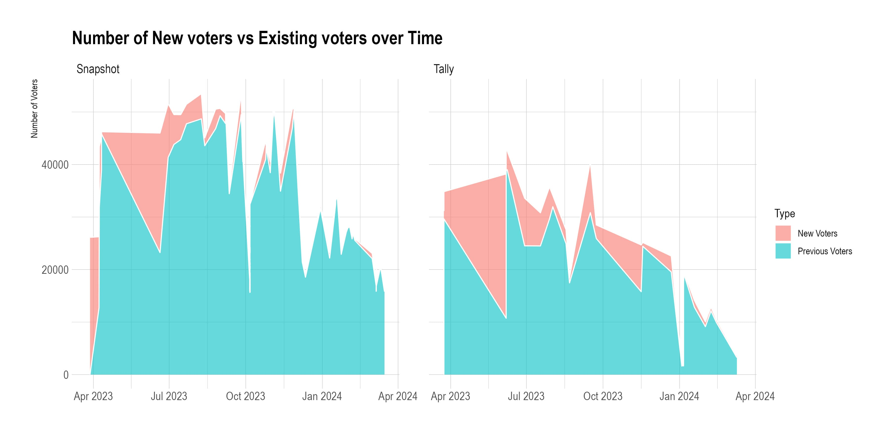

# ArbGovernanceParticipationAnalysis
This comprehensive analysis aims to unravel the trends and patterns of proposal voting engagement over time, illuminating the pivotal role these participants play in shaping the future of decentralized governance.

### Description
To kickstart this bounty, we meticulously gathered data on Arbitrum DAO's governance activities from Snapshot and Tally, channeling these insights into separate repositories. These repositories not only serve as foundational data sources for our current and future bounty submissions but also offer a rich starting point for any subsequent analysis, inviting the community to delve into the nuances of decentralized governance with ease.

## [SnapShot Proposal and Votes Data Scrape Pipeline](https://github.com/yogesh-bansal/ArbSnapshotData)

ArbSnapshotData Repo

&nbsp;
&nbsp;

## [Tally Proposal, Votes and Deelgaets Data Scrape Pipeline](https://github.com/yogesh-bansal/ArbTallyData)

ArbTallyData Repo

&nbsp;
&nbsp;

### Analysis

Leveraging this above enables us to conduct detailed analyses of governance activity, voter engagement, and cohort behavior, offering the Arbitrum ecosystem an insightful initial overview of participation dynamics.

#### 1. Number of Proposals over Time

Number of Proposals over Time

&nbsp;
&nbsp;

The initial visualization we produced captures the dynamic pace of proposal creation across both Snapshot and Tally. To date, the data reveals a robust activity with over 150 proposals recorded on Snapshot and just over 25 on Tally. This disparity stems from the intrinsic role of Snapshot votes, which act as pivotal "temperature checks" gauging the community's sentiment. Proposals that garner a substantial number of affirmative votes and meet the quorum requirements on Snapshot are then escalated for formal on-chain voting through Tally, marking a critical step in the decision-making process.

#### 2. Unique Voters over Time

Unique Voters over Time

&nbsp;
&nbsp;

In our analysis, a natural question emerged regarding the volume of votes per proposal over time on both Snapshot and Tally. Initially, both platforms experienced a surge in engagement, with Tally witnessing upwards of nearly 50,000 unique voters on a single proposal, and Snapshot surpassing this figure across multiple proposals. This trend of high participation marked the first half of our year-long exploration into governance. However, the narrative began to shift as we observed a decline in participation, measured by the count of unique voters on both platforms since the previous year. This trend signals a crucial call to action for the community, highlighting an evident need to bolster incentives for participation to elevate the number of active voters over time. Intriguingly, a different perspective emerges when examining the distribution of voting power over the same period, which reveals a slight but noticeable uptick in the concentration of voting power within these proposals. This nuanced observation suggests an evolving dynamic in governance participation and influence.

#### 3. Voting Power over time

Voting Power over Time

&nbsp;
&nbsp;

This trend hints at a potential shift towards more centralized decision-making within the ecosystem. Such centralization could stem from heightened rates of delegation or the accumulation of tokens within a smaller group of wallets actively participating in governance. This intriguing development lays the groundwork for further analysis, offering a rich vein of inquiry for those keen on delving deeper into the dynamics of decentralized governance in the future.

#### 4. Number of New voters vs Existing voters over Time

Number of New voters vs Existing voters over Time

&nbsp;
&nbsp;

Upon examining the participation trends of new versus existing voters in governance over time, we observe that both platforms initially boasted a significant influx of new voters, contributing substantially to the overall voting population. As time progressed, however, the influx of new voters on both Snapshot and Tally has dwindled to a minimal figure, highlighting a shift in the composition of the active voting community.

#### 5. Cohort Stickiness Heatmap

Cohort Stickiness Heatmap

&nbsp;
&nbsp;

The phenomenon of voter cohorts gradually disengaging becomes strikingly apparent through a heatmap that meticulously tracks proposal voters as distinct cohorts, subsequently monitoring the proportion of addresses that engage in Snapshot governance activities over time. A cohort initiating with a 100% participation rate indicates the influx of new voters for that specific proposal, with subsequent values reflecting the percentage of that cohort engaging in future proposals. Even a brief examination reveals that the initial cohorts participating in the governance process have demonstrated remarkable consistency in their voting patterns over time. However, as time progresses, it's evident that newer cohorts have not maintained the same level of engagement as their predecessors, indicating a shift in the participatory dynamics of the community.

